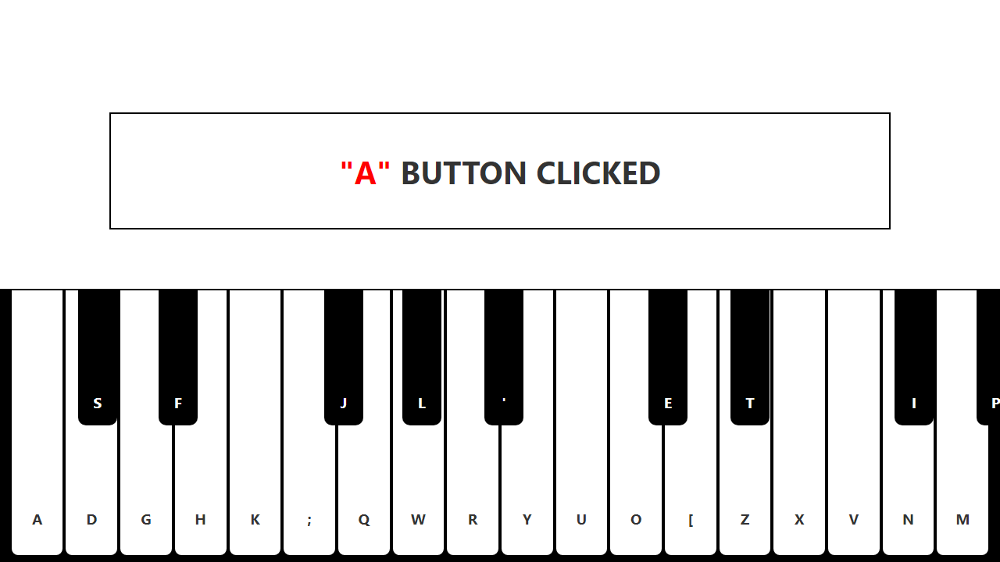

# JS-New-Styles

This repository hosts multiple projects with GitHub Pages.

## Projects

### Download Simulator
Folder: `Download Simulator/`  
Live Link: https://subhamku360.github.io/JS-New-Styles/Download%20Simulator/
Screenshot:  

  

### Random Quote Generater
Folder: `Random Quote Generater/`  
Live Link: https://subhamku360.github.io/JS-New-Styles/Random%20Quote%20Generater/
Screenshot:  

  

### Piyano
Folder: `Piyano/`  
Live Link: https://subhamku360.github.io/JS-New-Styles/Piyano/
Screenshot:  

  

### File Upload Method
Folder: `File Upload Method/`  
Live Link: https://subhamku360.github.io/JS-New-Styles/File%20Upload%20Method/
Screenshot:  

  

### Pinterest Clone
Folder: `Pinterest Clone/`  
Live Link: https://subhamku360.github.io/JS-New-Styles/Pinterest%20Clone/index.html
Screenshot:  

  

